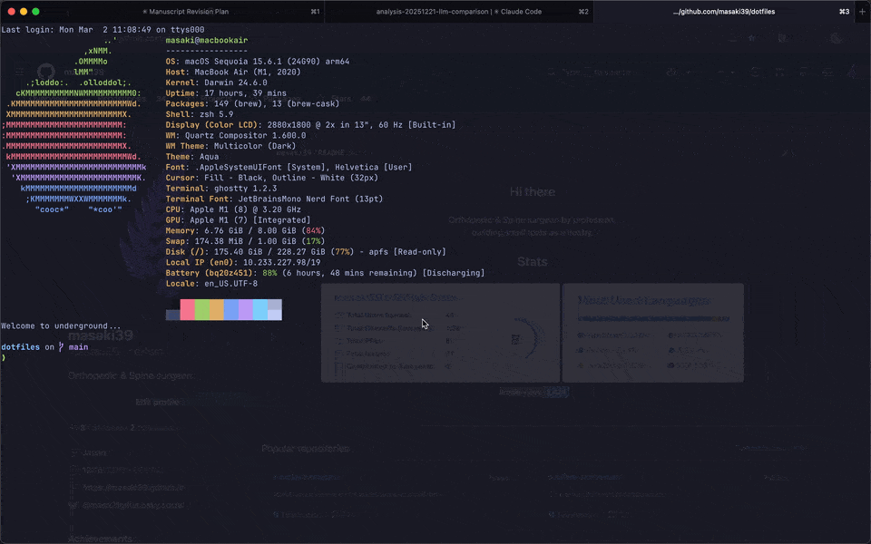

# Ryoiki.spoon

Window layout manager for [Hammerspoon](https://www.hammerspoon.org/).
Define layouts **across multi-screens** as individual Lua files and apply them via hotkeys or a chooser menu.



## 📦 Installation

Install [Hammerspoon](https://www.hammerspoon.org/) first if you haven't:

```bash
brew install --cask hammerspoon
```

Download [Ryoiki.spoon.zip](https://github.com/masaki39/ryoiki/raw/main/Spoons/Ryoiki.spoon.zip), open it to install, and add to `~/.hammerspoon/init.lua`:

```lua
hs.loadSpoon("Ryoiki")
spoon.Ryoiki.layouts_dir = "/path/to/your/layouts"  -- optional
spoon.Ryoiki:start()
spoon.Ryoiki:bindHotkeys({ showChooser = { {"ctrl", "alt"}, "m" } })
```

<details>
<summary>🚀 Via SpoonInstall</summary>

Download [SpoonInstall.spoon.zip](https://github.com/Hammerspoon/Spoons/raw/main/Spoons/SpoonInstall.spoon.zip) and open it to install if you haven't.

Add to `~/.hammerspoon/init.lua`:

```lua
hs.loadSpoon("SpoonInstall")
spoon.SpoonInstall.repos.ryoiki = {
    url = "https://github.com/masaki39/ryoiki",
    desc = "Ryoiki Spoon repository",
    branch = "main",
}
spoon.SpoonInstall:andUse("Ryoiki", {
    repo = "ryoiki",
    config = { layouts_dir = os.getenv("HOME") .. "/.hammerspoon/layouts" }, -- optional
    start = true,
    hotkeys = { showChooser = { {"ctrl", "alt"}, "m" } },
})
```

</details>

## 📁 Layout Files

Each `.lua` file in your layouts directory defines one layout.
The filename (without extension) is used as the layout name.
The default directory is `~/.hammerspoon/layouts/`.

### 🪟 Window Properties

| Property | Required | Default | Description |
|---|---|---|---|
| `app` | **required** | — | application bundle ID (e.g. `com.apple.Safari`) |
| `screen` | optional | `0` | 0-based screen index |
| `x` | optional | `0` | left edge as fraction of screen width (e.g. `0.5`) |
| `y` | optional | `0` | top edge as fraction of screen height (e.g. `0.5`) |
| `w` | optional | `1` | width as fraction of screen width (e.g. `0.7`) |
| `h` | optional | `1` | height as fraction of screen height (e.g. `1`) |
| `focus` | optional | `false` | focus this window after layout is applied |

### 📄 Example: `layouts/coding.lua`

```lua
return {
    keybind = "ctrl+alt+1",
    description = "Dev: Safari left, Terminal split right",
    windows = {
        { app = "com.apple.Safari",   screen = 0, x = 0,   y = 0,   w = 0.7, h = 1   },
        { app = "com.apple.Terminal", screen = 0, x = 0.7, y = 0,   w = 0.3, h = 0.5, focus = true },
        { app = "com.apple.Terminal", screen = 0, x = 0.7, y = 0.5, w = 0.3, h = 0.5 },
    },
}
```

> [!TIP]
> Run this in the terminal to find an app's bundle ID:
> ```bash
> osascript -e 'id of app "Safari"'
> ```

> [!TIP]
> Run this in the Hammerspoon console to find your screen indices:
> ```lua
> for i, s in ipairs(hs.screen.allScreens()) do
>     print(i-1, s:name(), s:frame())
> end
> ```

## 🏷️ Version Management (for developers)

Use `version.sh` to bump the version, regenerate the zip, and commit + tag in one step:

```bash
chmod +x version.sh   # first time only
./version.sh patch    # patch bump (default)
./version.sh minor    # minor bump
./version.sh major    # major bump
```

Then push:

```bash
git push && git push --tags
```
