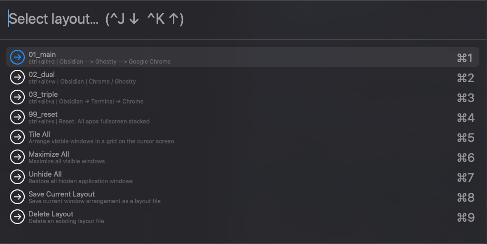
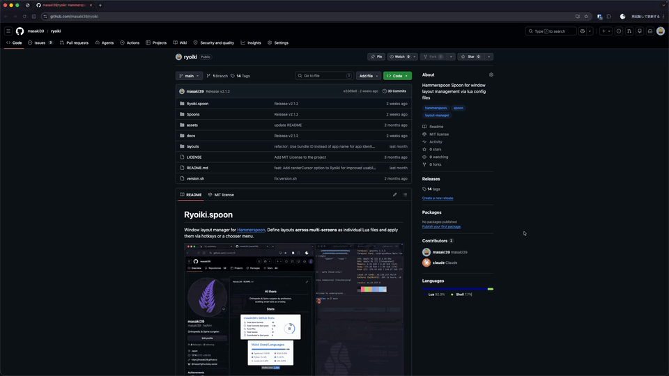

# Ryoiki(領域).spoon

Window layout manager for [Hammerspoon](https://www.hammerspoon.org/).  
Define multi-screen window layouts as Lua files and apply them via hotkeys or a chooser menu.



- Layout files are plain Lua — easy to edit and version-control
- Apply layouts by hotkey or from the chooser (`^J`/`^K` to navigate)
- Address screens by name (`"primary"`, `"built-in"`, `"LG"`) or 0-based index
- Built-in actions: Tile All, Maximize All, Unhide All, Save/Delete layouts

## 📦 Installation

Install [Hammerspoon](https://www.hammerspoon.org/) first if you haven't:

```bash
brew install --cask hammerspoon
```

Download [Ryoiki.spoon.zip](https://github.com/masaki39/ryoiki/raw/main/Spoons/Ryoiki.spoon.zip), open it to install, and add to `~/.hammerspoon/init.lua`:

```lua
hs.loadSpoon("Ryoiki")
spoon.Ryoiki.layouts_dir = "/path/to/your/layouts"  -- optional
spoon.Ryoiki.centerCursor = true                     -- optional (default: false)
spoon.Ryoiki:start()
spoon.Ryoiki:bindHotkeys({ showChooser = { {"ctrl", "alt"}, "m" } })
```

<details>
<summary>🚀 Via SpoonInstall</summary>

Download [SpoonInstall.spoon.zip](https://github.com/Hammerspoon/Spoons/raw/main/Spoons/SpoonInstall.spoon.zip) and open it to install if you haven't.

Add to `~/.hammerspoon/init.lua`:

```lua
hs.loadSpoon("SpoonInstall")
spoon.SpoonInstall.repos.ryoiki = {
    url = "https://github.com/masaki39/ryoiki",
    desc = "Ryoiki Spoon repository",
    branch = "main",
}
spoon.SpoonInstall:andUse("Ryoiki", {
    repo = "ryoiki",
    config = {
        layouts_dir  = os.getenv("HOME") .. "/.hammerspoon/layouts",
        centerCursor = true,
    },
    start = true,
    hotkeys = { showChooser = { {"ctrl", "alt"}, "m" } },
})
```

</details>

## 📁 Layout Files

Each `.lua` file in your layouts directory defines one layout.
The filename (without extension) becomes the layout name shown in the chooser.
The default directory is `~/.hammerspoon/layouts/`.


### 📄 Example: `layouts/coding.lua`

```lua
return {
    keybind = "ctrl+alt+1",
    description = "Dev: Safari left, Terminal split right",
    windows = {
        { app = "com.apple.Safari",   screen = "primary", x = 0,   y = 0,   w = 0.7, h = 1   },
        { app = "com.apple.Terminal", screen = "primary", x = 0.7, y = 0,   w = 0.3, h = 0.5, focus = true },
        { app = "com.apple.Terminal", screen = "primary", x = 0.7, y = 0.5, w = 0.3, h = 0.5 },
    },
}
```

### 🪟 Window Properties

| Property | Required | Default | Description |
|---|---|---|---|
| `app` | **required** | — | application bundle ID (e.g. `com.apple.Safari`) |
| `screen` | optional | `0` | `0`-based index, `"primary"`, `"built-in"`, or partial display name (e.g. `"LG"`) |
| `x` | optional | `0` | left edge as fraction of screen width |
| `y` | optional | `0` | top edge as fraction of screen height |
| `w` | optional | `1` | width as fraction of screen width |
| `h` | optional | `1` | height as fraction of screen height |
| `focus` | optional | `false` | focus this window after layout is applied |

> [!TIP]
> Run this in the terminal to find an app's bundle ID:
> ```bash
> osascript -e 'id of app "Safari"'
> ```

> [!TIP]
> Run this in the Hammerspoon console to list screen indices and names:
> ```lua
> for i, s in ipairs(hs.screen.allScreens()) do print(i-1, s:name()) end
> ```
> Use the index (`0`, `1`, …) or the name string (`"LG"`, `"built-in"`, …) as the `screen` value.
> Index-based addressing is useful when the same monitor is always connected in the same slot.

## ⚡ Built-in Actions

No layout file needed — these actions are always available from the chooser or via hotkeys.



| Action | Description |
|---|---|
| **Tile All** | Arrange all visible windows on the cursor screen in a grid |
| **Maximize All** | Maximize all visible windows |
| **Unhide All** | Restore all hidden application windows |
| **Save Current Layout** | Capture current window positions and save as a layout file |
| **Delete Layout** | Delete an existing layout file |

```lua
spoon.Ryoiki:bindHotkeys({
    showChooser  = { {"ctrl", "alt"}, "m" },
    tileAll      = { {"ctrl", "alt"}, "t" },
    maximizeAll  = { {"ctrl", "alt"}, "f" },
    unhideAll    = { {"ctrl", "alt"}, "u" },
    saveLayout   = { {"ctrl", "alt"}, "s" },
    deleteLayout = { {"ctrl", "alt"}, "d" },
})
```

Or call them directly from Lua:

```lua
spoon.Ryoiki:tileAll()
spoon.Ryoiki:maximizeAll()
spoon.Ryoiki:unhideAll()
spoon.Ryoiki:saveCurrentLayout("my-layout")
spoon.Ryoiki:deleteLayout("my-layout")
```

## 🏷️ Version Management (for developers)

Use `version.sh` to bump the version, regenerate the zip, and commit + tag in one step:

```bash
chmod +x version.sh   # first time only
./version.sh patch    # patch bump (default)
./version.sh minor    # minor bump
./version.sh major    # major bump
```

Then push:

```bash
git push && git push --tags
```
